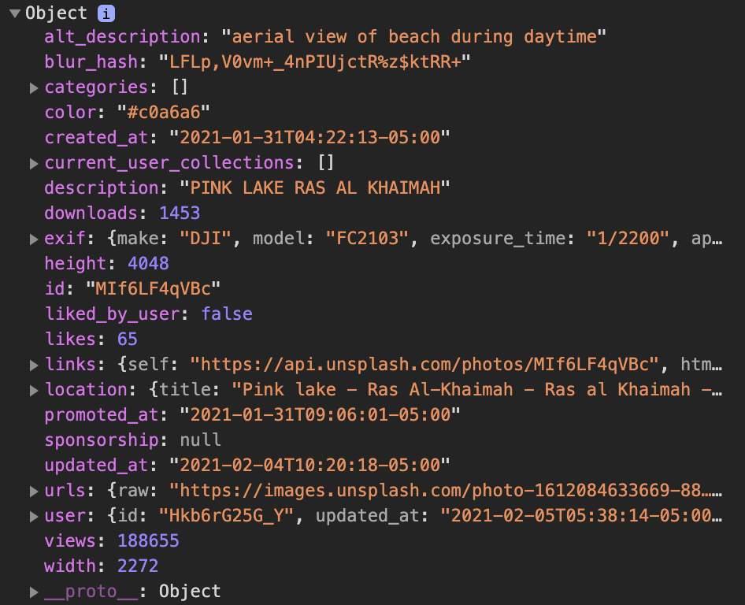
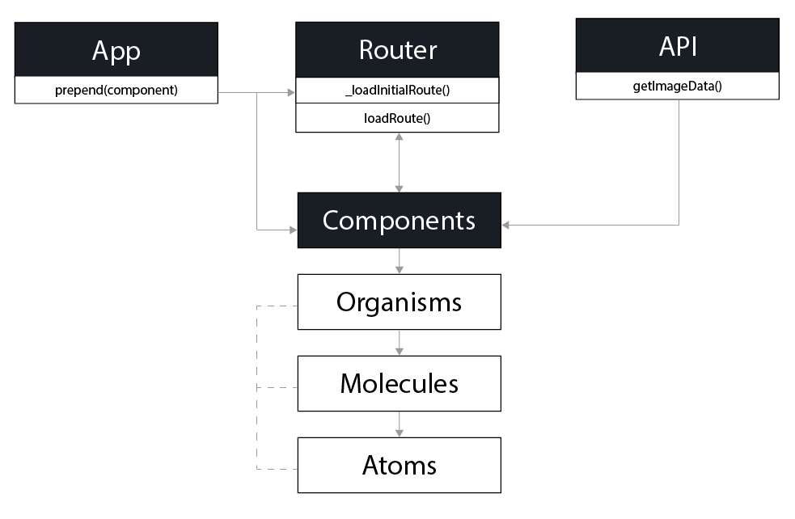
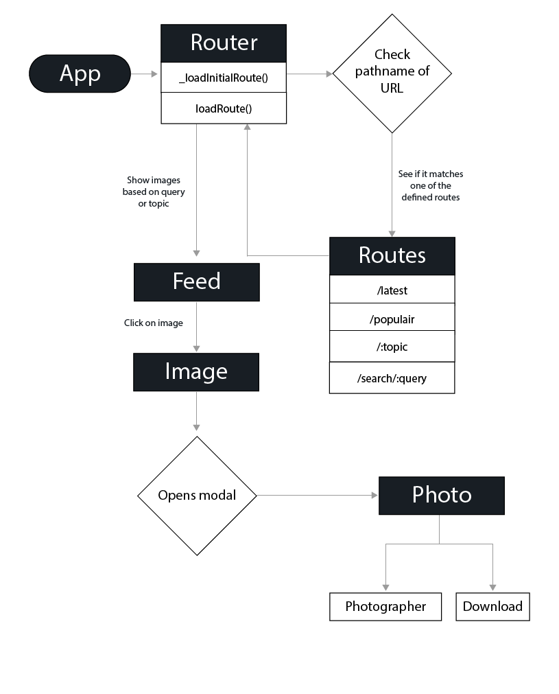

# ImageFeeder

ImageFeeder is an application build with the [Unsplash API](https://github.com/unsplash/unsplash-js). It shows you a feed of the latest photo's added to Unsplash and their corresponding photographers. You can view the photo's and their details, search for specific photo's trough keywords or just view random pictures. The application uses only vanilla code and no modules or libraries. It's a one-page, client-side rendered, modular web-application.

## Live Demo
Check the live demo [here](https://imagefeeder.netlify.app/)

## How to use?
1. [Download](https://github.com/MarvinMichel/imageFeeder/archive/master.zip) or clone the repo
2. Open the terminal and navigate into the projects' directory: `cd ./imageFeeder`
3. Install the dependencies by running `npm install`
4. Start the development server: `http-server-spa . ./index.html`

## Unsplash API

This project's using the Unsplash API to get the photos and search trough their database with keywords. The API can retrieve a photo object with different attributes. This object can be used to render data to the screen and show it to the user. We can retrieve the url to the image to display it inside a figure. Beneath the image we can show some statistics like the user and the number of likes and downloads. Inside the object we'll retrieve a link to the users' profilepage and create a link to give the photographer a larger podium. 

You can check out an example of an photo-object [here](docs/object-example.json)

>🤓 For more information to use the API, check the [documentation](https://unsplash.com/documentation).

## Design System
The design system applied in this project will be based on the [Atomic Design by Brad Frost](https://bradfrost.com/blog/post/atomic-web-design/). This means the Javascript code will be split into different layers and functions, hereby creating reusable code troughout the application.

## Client-side router
The application uses client-side routing. I've created the router based on [Will Taylors'](https://www.willtaylor.blog/client-side-routing-in-vanilla-js/) article. With the router, we use the [History API](https://developer.mozilla.org/en-US/docs/Web/API/History_API) so we can use the back and forward buttons of the browser to navigate trough the routes.

## Actor & Interaction Diagram
1. The main purpose of the application is a simple way for the user to look for photographs. This can be done by searching for keywords or exploration.
2. The functionalities needed for this:
    - User can search for keyword(s).
    - Application is connected to the Unsplash API.
    - User can switch tabs for different results.
    - Application can generate modulair HTML.
    - Application can open modals for photo-details or errors.
3. The actors needed for those functionalities:
    - DOM-handlers.
    - An error handler.
    - An API-handler.
    - A client-side router.
    - Organisms to handle molecules.
    - Molecules to handle atoms.
    - Atoms to handle interaction.
4. The posible user interactions are:
    - Type a keyword in searchbar to change feed.
    - Press a navigational tab to change feed.
    - Use back & forward buttons to navigate trough history.
    - Click images to open modal with photo-details.

### Actor Diagram

### Interaction Diagram

## License
[MIT License](LICENSE)
